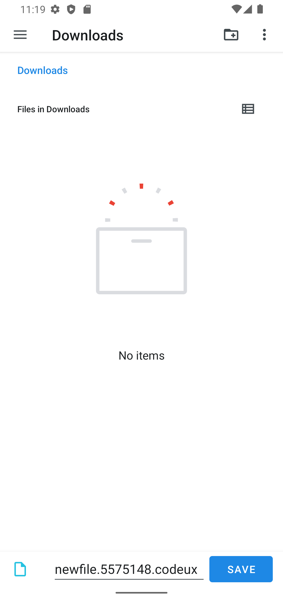

[](https://pub.dev/packages/file_picker_writable)

# file_picker_writable

Flutter plugin to choose files which can be read, referenced and written back at a
  later time (persistent permissions on android, secure bookmarks on iOS).

It also offers handlers for open intents when the user wants to open associated files from
other apps. In the same way it will also handle arbitrary URLs and pass them back to dart.

# Requirements


## iOS

* iOS 8 + Swift 5
* Only tested on iOS 13+, so let me know ;-)

### Support for file handlers

1. Configure an OTI Type: https://developer.apple.com/library/archive/qa/qa1587/_index.html
2. Add to plist file:
   ```
	<key>UISupportsDocumentBrowser</key>
	<false/>
	<key>LSSupportsOpeningDocumentsInPlace</key>
	<true/>
   ```

## Android

* Android 4.4 (API Level 4.4)
* Only supports [plugin api v2](https://flutter.dev/go/android-project-migration).

### Support for file handlers

#### AndroidManifest.xlm
```xml
            <intent-filter>
                <action android:name="android.intent.action.VIEW"  />
                <category android:name="android.intent.category.DEFAULT" />
                <category android:name="android.intent.category.BROWSABLE" />
                <data android:scheme="file" />
                <data android:scheme="content" />
                <data android:host="*"  />
                <data android:mimeType="*/*" />
                <!-- https://stackoverflow.com/a/52384331/109219 ?? -->
                <data android:pathPattern=".*\\.codeux" />
                <data android:pathPattern=".*\\..*\\.codeux" />
                <data android:pathPattern=".*\\..*\\..*\\.codeux" />
                <data android:pathPattern=".*\\..*\\..*\\..*\\.codeux" />
                <data android:pathPattern=".*\\..*\\..*\\..*\\..*\\.codeux" />
                <data android:pathPattern=".*\\..*\\..*\\..*\\.*\\..*\\.codeux" />
            </intent-filter>
```

## MacOS

Is currently not supported. The only thing the plugin will do is listen for URL Events
and pass them through to the dart side.


## Getting Started

See the example on how to implement it in a simple application.

```dart
Future<void> readFile() async {
  final fileInfo = await FilePickerWritable().openFile((fileInfo, file) async {
    _logger.fine('Got picker result: $fileInfo');

    // now do something useful with the selected file...
    _logger.info('Got file contents in temporary file: $file');
    _logger.info('fileName: ${fileInfo.fileName}');
    _logger.info('Identifier which can be persisted for later retrieval:'
        '${fileInfo.identifier}');
    return fileInfo;
  });
  if (fileInfo == null) {
    _logger.info('User canceled.');
    return;
  }
}
```

The returned `fileInfo.identifier` can be used later to write or read from the data,
even after an app restart.

```dart
Future<void> persistChanges(FileInfo fileInfo, Uint8List newContent) async {
  // tell FilePickerWritable plugin to write the new contents over the user selected file
  await FilePickerWritable().writeFile(
      identifier: fileInfo.identifier,
      writer: (file) async {
        // write new content into the temporary file.
        await file.writeBytes(newContent);
      });
}
```

Create a new file by letting the user choose a directory and file name:

```dart
final rand = Random().nextInt(10000000);
final fileInfo = await FilePickerWritable().openFileForCreate(
  fileName: 'newfile.$rand.codeux',
  writer: (file) async {
    final content = 'File created at ${DateTime.now()}\n\n';
    await file.writeAsString(content);
  },
);
if (fileInfo == null) {
  _logger.info('User canceled.');
  return;
}
final data = await _appDataBloc.store.load();
await _appDataBloc.store
    .save(data.copyWith(files: data.files + [fileInfo]));
}
```

This will open the following screen on Android:


